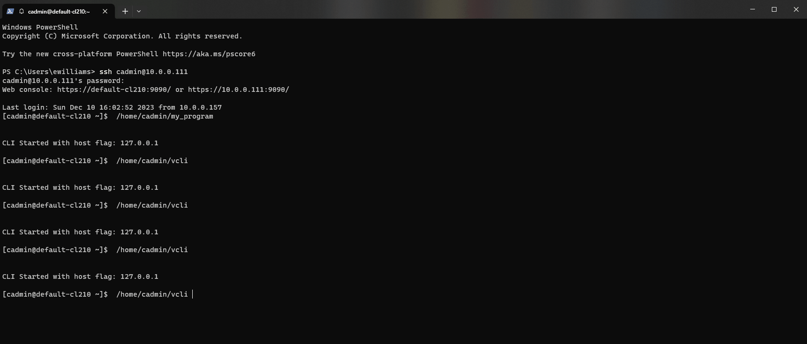
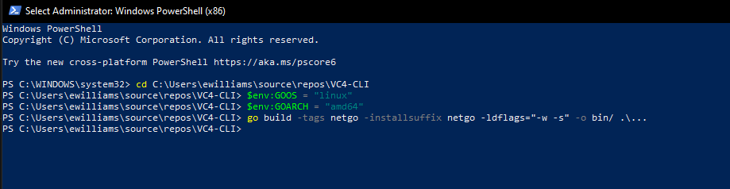

[](https://goreportcard.com/report/github.com/ewilliams0305/VC4-CLI)
```go
__      _______ _  _      _____ _      _____ 
\ \    / / ____| || |    / ____| |    |_   _|
 \ \  / / |    | || |_  | |    | |      | |  
  \ \/ /| |    |__   _| | |    | |      | |  
   \  / | |____   | |   | |____| |____ _| |_ 
    \/   \_____|  |_|    \_____|______|_____|
```


# VC4-CLI
Ever found yourself connected to a VC4 appliance troublshooting the OS, working on the file system,
or restarting services, only to find you can't perform actions on the actual VC4 service? Well now you can. 
The VC4 CLI provides full control over the VC4 service from within the linux terminal allowing operators to:


Command line interface to operate a Crestron Virtual Control server application from the Linux Shell
The VC4 CLI leverages the Crestron Virtual control REST API with a loopback IP address 
to provide a localized CLI for the VC4 service. This CLI 
uses the `BubbleTea` TUI framework for navigation and command line workflows. 

# Building 
To compile the cli for your VC4 appliance you will need to install
the GO sdk. Download the SDK at https://go.dev/dl/ Once download you can build the ~/. root repository directory as an executable. 

## Windows
To build on windows for windows simply navigate to the repostiry root director and issue `go build ./...` to compile an EXE including all child modules.  See the go sdk documentation for more details and optional compiler flags.

## Linux
To build the CLI from a windows computer for the VC4 appliance, you can use the go cross compiler.  Ensure the go compiler is installed on your machine and open a  terminal session.



Change you directory to the repository root directory
`cd ./`

Set the  and  environment variables to 

`VC4-CLI> $env:GOOS = "linux"`
`VC4-CLI> $env:GOARCH = "amd64"`

Run the  command to create a new executable in the bin directory that will run on you VC4 appliance.

`VC4-CLI> go build -tags netgo -installsuffix netgo -ldflags="-w -s" -o bin/ .\...`

Once compiled you should have a file titled  with no file extension (remeber linux...).

Copy this file to your VC4 appliance and execute `chmod +x ./VC4-CLI` to allow execution.  Finally run the application `./VC4-CLI`.  Of course you can name this file anything you like and add addtional flags to the go build command.

# Crestron REST API Reference 
https://www.crestron.com/getmedia/29921c49-86df-488c-a63b-ab88620d7175/mg_pg_rest-api-crestron-virtual-control


