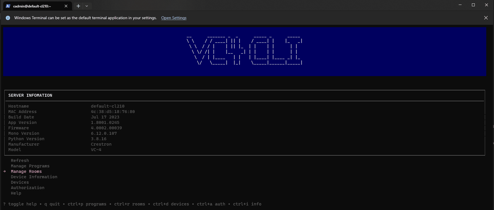
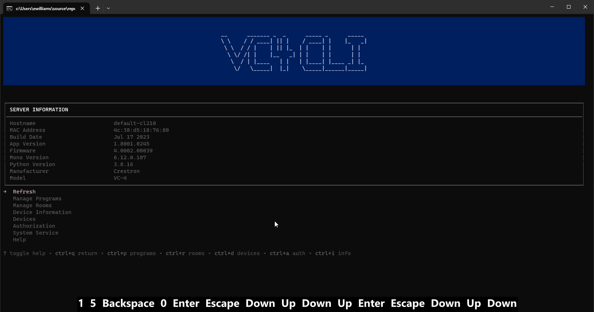
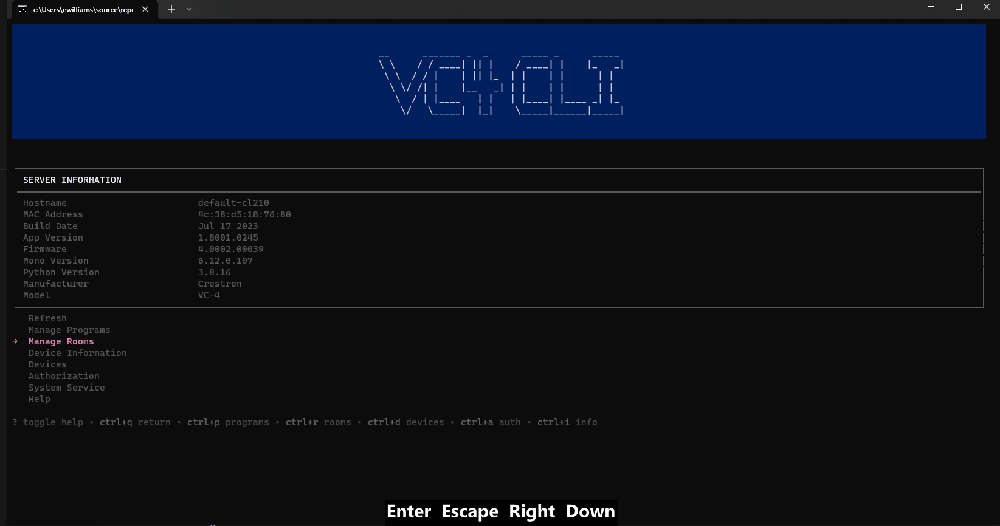
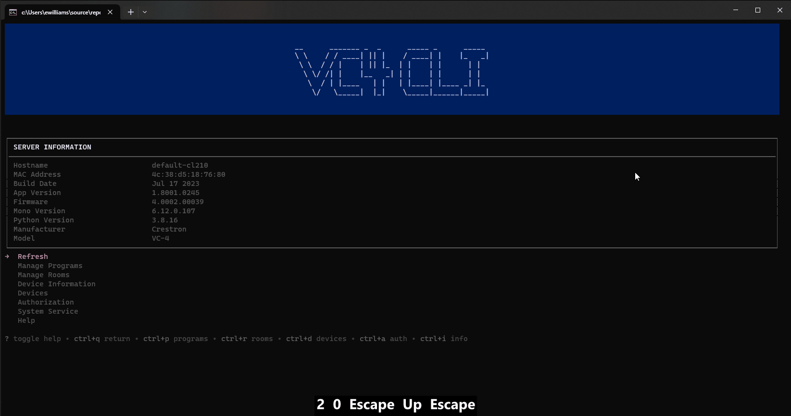

 
 

# 🆑 vcli
Ever found yourself connected to a VC4 appliance troublshooting the OS, working on the file system,
or restarting services, only to find you can't perform actions on the actual VC4 service? Well now you can. 
The VC4 CLI provides full control over the VC4 service from within the linux terminal allowing operators to:

Command line interface to operate a Crestron Virtual Control server application from the Linux Shell
The VC4 CLI leverages the Crestron Virtual control REST API with a loopback IP address 
to provide a localized CLI for the VC4 service. This CLI 
uses the `BubbleTea` TUI framework for navigation and command line workflows. 

# 👷‍♂️ Building 
To compile the cli for your VC4 appliance you will need to install
the GO sdk. Download the SDK at https://go.dev/dl/ Once download you can build the ~/. root repository directory as an executable. 

## 🪟 Windows
To build on windows for windows simply navigate to the repostiry root director and issue `go build ./...` to compile an EXE including all child modules.  See the go sdk documentation for more details and optional compiler flags.

## 🐧 Linux
To build the CLI from a windows computer for the VC4 appliance, you can use the go cross compiler.  Ensure the go compiler is installed on your machine and open a PowerShell terminal session.

Change your directory to the repository root directory

`cd ./`

Set the GOOS and GOARCH environment variables to 

 `vcli> $env:GOOS = "linux"`

 `vcli> $env:GOARCH = "amd64"`

Run the GO BUILD command to create a new executable in the bin directory that will run on your VC4 appliance. 
The flags used will optimize the compilation and output the linux amd64 binary to the ./bin directory in the repository. 

`vcli> go build -tags netgo -installsuffix netgo -ldflags="-w -s" -o bin/ .\...`

Once compiled you should have a file titled with the name of your repositories root directory with no file extension (remeber linux...).

Copy this file to your VC4 appliance and execute `chmod +x ./vcli` to allow execution.  Finally run the application `./vcli`.  Of course you can name this file anything you like and add addtional flags to the go build command.

 *Of course you could just install make and type `make all`*

# 🚀 Launching
Once compiled you can launch the application by executing the binary. 
The application supports serveral command line argument flags

`-host` or short `-h`  // Specify Host

`-token` or short `t`  // Provide API Key

`-file` or short `f`   // Program File Path

`-name` or short `n`   // Program Name

`-roomid` or short `r` // Room Name

`-override` or short `-o` // Overrides the program by Name if found

## Host & Token
If no host flag is provided the application is assumed to be executing on the VC4 appliance and localhost will be used. 
for local host operation NO TOKEN IS REQUIRED, yes, no token. This means the cli can be instantly used without every logging into
the VC4 webpage. 

When the application is started with a host and token flag the cli will target a remote server. I've also 
this from one VC4 to another VC4. Lauch the app with flags;

`./vcli -h 10.0.0.111 -t "TOKEN_HERE"`

If the VC4 service is running you will instantly see the device information table loaded with data. 

## Program File

Programs can be uploaded to the server with a simple combination of application arguments. 
 
To launch the application and instantly upload a program execute the app with:

`./vcli -f /home/prog.cpz -n My Program`

a new program entry will be created titled "My Program"

By its self a program file flag will not execute any initial actions on the server. 
A -f and -n flag are required. provide a full path to file on the system running the vcli app. 
When running the app on the virtual control server the file path is mapped to a file on the server. 
When running the application from your machine the path should be a local file on your file system. 

when loading or better reloading a program the -o flag should be provided to edit the exiting entry and restart the effected rooms. 

## Room ID

Appending the -r flag will upload the program and start a new room with provided room id. 

`./vcli -f /home/prog.cpz -n My Program -r UBER_ROOM`

A new program will be uploaded and a room will be instantly instantiated with the provided Room ID. 

# 🦮 Guides
Tutorials for the `vcli` providing use cases and examples 

## 🚻 Controlling Rooms

### Start and stop rooms
Users can start, stop, enable/disable debugging, and restart rooms.  All room CRUD operations are availble, reate new rooms, edit, and delete. 

### Add and remove rooms
Navigate to the rooms menu and press 'ctrl+n' to select a program from the program library.  OR, navigate to the program menu and press 'ctrl+r' to create a new room instance from the highlighted program.

## 🧑‍💻 Programs
Users can create, edit, and delete program entries. users can also spin up rooms from either the program view or the room interface. 

### Creating Programs
Navigate to the program menu and press 'ctrl+n'.  Complete the form with at minumum a specified file path and a name.  Note the file path is relative the execution of the vcli, when running on you local machine file specify a file on you local file system, when running on the VC4 server specify a file path on the server.

### Deleting Programs

Navigate to the program menu, with the program highlighted press ctrl+d or the delete key.  When prompted selected yes to delete the program and any effected rooms.

## ⚖️ Authorization and Licenses

## 📲 Device mapping and status

## ℹ️ System information 

The system view can be selected from the main menu and used to manage the 
virtual control service. The system view provides 

- real-time logs
- start virtual control
- stop virtual control
- restart virtual control

All system actions will redirect your terminal session to system journal output in an Alt Terminal session. 
pressing `ctrl+c` will exit the alt T and return you to the `vcli` interface. 

# 🕸️ Crestron REST API Reference 
https://www.crestron.com/getmedia/29921c49-86df-488c-a63b-ab88620d7175/mg_pg_rest-api-crestron-virtual-control

